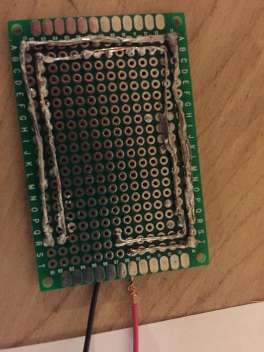
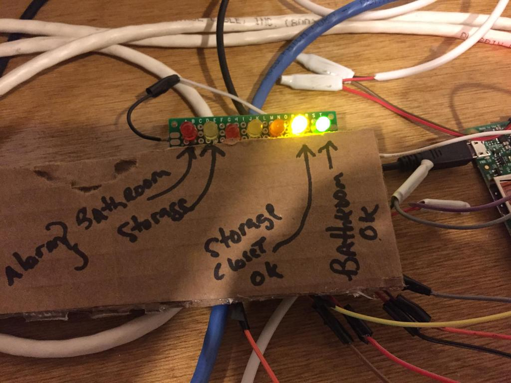

# waterpi
Water sensor for raspberry pi.
Some code to monitor a basement floor or other area
for water, alert and clear when the condition is corrected.

# install
* copy waterpi.yaml to /etc
* edit it with your slack webhook if you want 
* edit it with your sns topic so you can get SMS texts
* add some lines to /boot/config.txt (depends on pins you use for thermo)
```
# jgu for thermo DS18B20
dtoverlay=w1-gpio,gpiopin=27
dtparam=i2c_arm=on
```


# Features
* poll a physical sensor 
* generate an alert when wet
* generate a clear when resolved
* call out to external script for sending SMS text or other commands
* control an led, flashing = program running and solid is alarm state

# File notes
* alert and clear sh files are stubs. replace them with your actions
* water.py is a sample sensor
* water2.py is just another sensor
* one copy of the program runs per sensor for now, I'm lazy
* modify the sensor_name because its what spews to screen
* a few jpg's to show a sample [display](display.jpg) and [sample sensor](sensor.jpg)
* start_sensors.sh can be called from rc.local to start a screen session on boot
* send_slack.py uses waterpi.yaml, copy to /etc and edit the webhook
* mouse_trap.py has nothing to do with water alarms, but is connected to the same raspberry pi so it's in here

# Dashboards
* Sample [freeboard.io dashboard](https://freeboard.io/board/E4LaM5)

# parts list
* [leds with resistors](http://www.amazon.com/gp/product/B004JO2PVA?psc=1&redirect=true&ref_=oh_aui_search_detailpage)
* [sensor plate and display panel](http://www.amazon.com/gp/product/B00L660Q10?psc=1&redirect=true&ref_=oh_aui_search_detailpage)
* [b connectors for joining wire](http://www.amazon.com/Dolphin-DC-100P-Super-Connector-Pcs/dp/B000JP7FIQ/)
* [alarm wire](http://www.amazon.com/gp/product/B00CHPX6OI?psc=1&redirect=true&ref_=oh_aui_search_detailpage)
* [jumper wires to pi](http://www.amazon.com/Kalevel%C2%AE-120pcs-Multicolored-Female-Breadboard/dp/B00M5WLZDW/)
* [premade sensor to copy from](http://www.amazon.com/Control-Products-WS-600-WaterSensor/dp/B0058RVN4M/)

# special thanks
* adapted from reading [this page](https://pi.gate.ac.uk/pages/basics.html#flood-alarm)

# Images of physical interfaces
# Water Sensor

# Control Panel

# Mouse Trap

